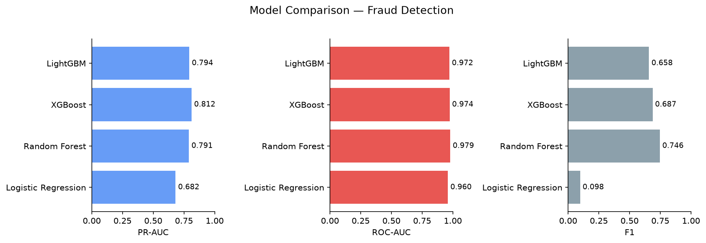
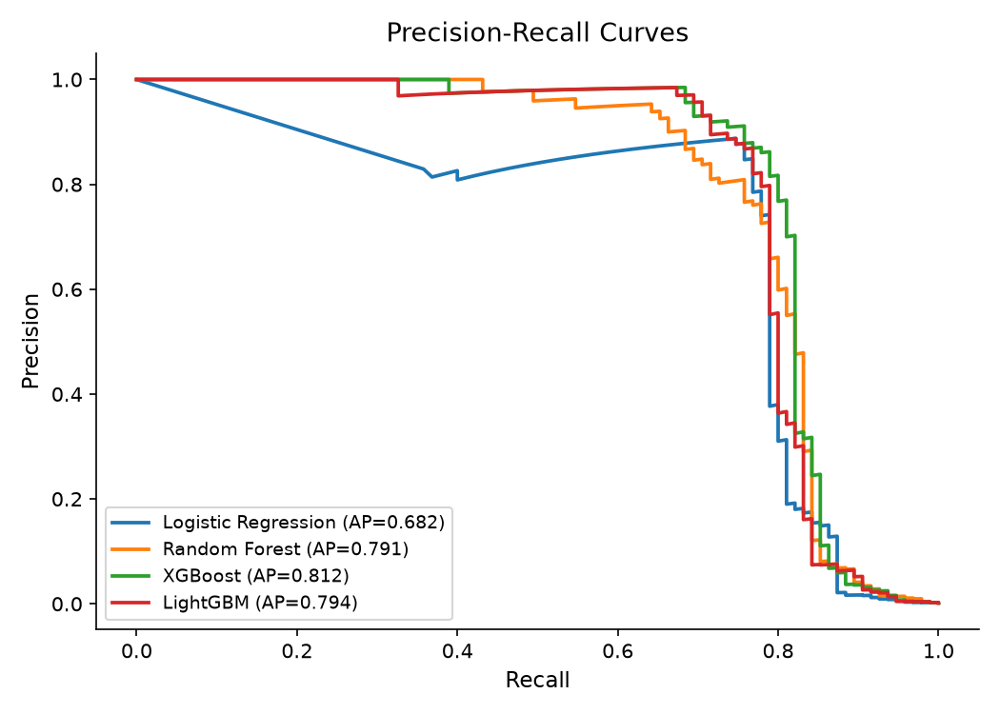
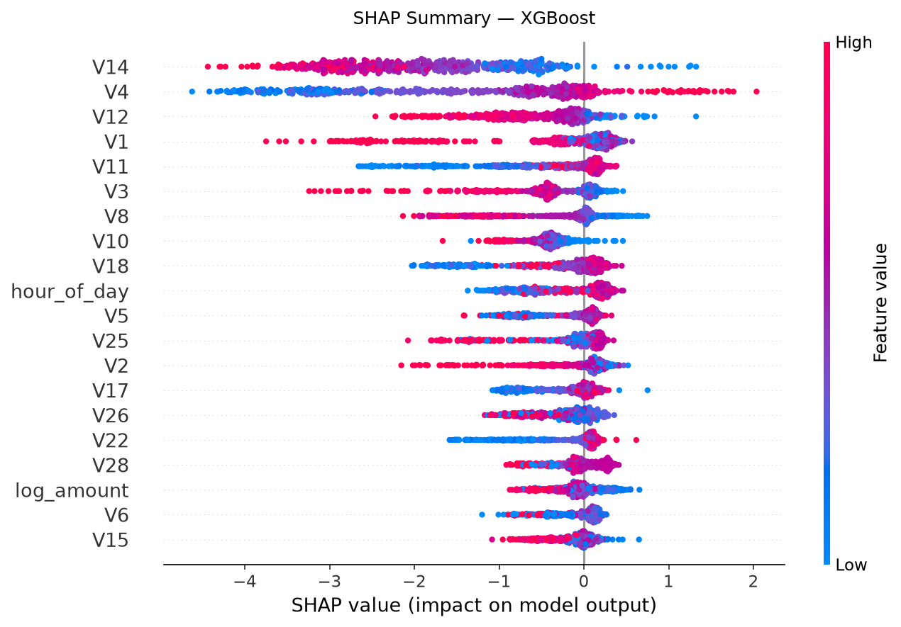

# Credit Card Fraud Detection System

End-to-end ML pipeline detecting fraudulent credit card transactions on the [ULB dataset](https://www.kaggle.com/datasets/mlg-ulb/creditcardfraud) — 284,807 transactions, 0.17% fraud rate.

## Results

| Model | PR-AUC | ROC-AUC | F1 |
|---|---|---|---|
| Logistic Regression | 0.682 | 0.960 | 0.098 |
| Random Forest | 0.786 | 0.979 | 0.754 |
| **XGBoost ✓** | **0.812** | **0.974** | **0.687** |
| LightGBM | 0.794 | 0.972 | 0.658 |

**XGBoost** won on PR-AUC — catching **82% of fraud cases** on the held-out test set.

## Pipeline

```
Raw Data → Stratified Split (80/20) → StandardScaler → SMOTE → Model Training → SHAP Explainability → Streamlit Demo
```

Key decisions:
- **Split before scaling/SMOTE** — prevents data leakage
- **PR-AUC as primary metric** — accuracy is meaningless at 0.17% fraud rate
- **SMOTE on train only** — balances from 600:1 to 1:1 without contaminating the test set
- **SHAP TreeExplainer** — every fraud flag has a human-readable reason

## Output charts





## How to run

```bash
pip install scikit-learn imbalanced-learn xgboost lightgbm shap streamlit matplotlib seaborn pandas numpy joblib

# Download creditcard.csv from Kaggle and place it in this folder
# https://www.kaggle.com/datasets/mlg-ulb/creditcardfraud

python pipeline.py        # trains all 4 models, saves charts + best model
streamlit run app.py      # launches the interactive demo
```

## Stack

Python · scikit-learn · XGBoost · LightGBM · SHAP · Streamlit · pandas · matplotlib
